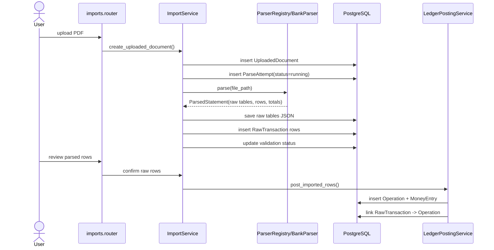

# ARCHITECTURE.md — Booker Tee

Engineering architecture for Booker Tee.

This document defines how code should be structured, how data should move through the system, and which boundaries must not be violated. It should be read together with:

- `PROJECT_VISION.md` — product positioning and target users;
- `MVP.md` — parser-first MVP scope;
- `DOMAIN_MODEL.md` — canonical domain entities and invariants;
- `AGENTS.md` — instructions for Codex and other coding agents.

---

## 1. Architecture goal

Booker Tee must be built as a reliable financial-data import and review system first.

The first architectural priority is this flow:

```text
PDF bank statement
  -> UploadedDocument
  -> ParseAttempt
  -> raw extracted tables/text JSON
  -> RawTransaction
  -> normalization
  -> validation and deduplication
  -> review screen
  -> confirmed Operation + MoneyEntry
  -> balances and simple reports
```

Use the principle:

```text
Parser-first, ledger-ready.
```

This means:

1. The MVP prioritizes the PDF-to-ledger pipeline.
2. Raw source data is always preserved.
3. Parsers never create confirmed ledger records directly.
4. User review happens before posting into the ledger.
5. Confirmed rows are stored in the correct financial model: `Operation 1 -> N MoneyEntry`.

---

## 2. Architectural non-goals for the first MVP

Do not build these before the first working PDF-to-ledger flow:

```text
full personal finance tracker
full manual operation UI
advanced category management
full property management
tenant management
meter readings
security deposits workflow
Telegram bot
email / IMAP import
RAG
Text-to-SQL
local LLM assistant
pgvector search
multi-user invitation UI
advanced RBAC
complex dashboards
mobile app
Telegram Mini App
```

The architecture may leave extension points for these later, but they must not block the MVP.

---

## 3. Tech stack

Use the stack already defined in `AGENTS.md` unless the repository contains a deliberate later change.

```text
Language:             Python 3.12+
Web framework:        FastAPI
ORM:                  SQLAlchemy 2.0 async style
Migrations:           Alembic
Validation:           Pydantic v2
Database:             PostgreSQL
Server-side UI:       Jinja2 templates
Interactivity:        HTMX
Small client state:   Alpine.js
Styling:              Tailwind CSS
PDF extraction:       pdfplumber
Package management:   uv
Formatting/linting:   Ruff
Type checking:        ty
Testing:              pytest
```

Background jobs:

```text
MVP:        synchronous service call or FastAPI BackgroundTasks when enough
Later:      Celery + Redis for heavy PDF parsing, retries, scheduled imports, notifications
```

AI and vector search:

```text
MVP:        not included
Later:      local embeddings, pgvector, RAG, local LLM if explicitly added
```

---

## 4. Repository layout

Recommended project layout:

```text
.
├── AGENTS.md
├── ARCHITECTURE.md
├── DOMAIN_MODEL.md
├── MVP.md
├── PROJECT_VISION.md
├── ROADMAP.md
├── pyproject.toml
├── uv.lock
├── alembic.ini
├── migrations/
│   ├── env.py
│   └── versions/
├── src/
│   └── app/
│       ├── __init__.py
│       ├── main.py
│       ├── core/
│       │   ├── __init__.py
│       │   ├── config.py
│       │   ├── database.py
│       │   ├── errors.py
│       │   ├── logging.py
│       │   ├── security.py
│       │   └── settings.py
│       ├── db/
│       │   ├── __init__.py
│       │   ├── base.py
│       │   ├── session.py
│       │   └── types.py
│       ├── shared/
│       │   ├── __init__.py
│       │   ├── dates.py
│       │   ├── enums.py
│       │   ├── money.py
│       │   ├── pagination.py
│       │   └── result.py
│       ├── features/
│       │   ├── __init__.py
│       │   ├── users/
│       │   ├── workspaces/
│       │   ├── accounts/
│       │   ├── imports/
│       │   ├── ledger/
│       │   ├── categories/
│       │   ├── properties/
│       │   └── reports/
│       ├── templates/
│       │   ├── base.html
│       │   ├── components/
│       │   ├── accounts/
│       │   ├── imports/
│       │   ├── ledger/
│       │   └── reports/
│       └── static/
│           ├── css/
│           ├── js/
│           └── images/
└── tests/
    ├── conftest.py
    ├── fixtures/
    │   └── pdf_statements/
    ├── unit/
    ├── integration/
    └── e2e/
```

This layout may be adjusted if the existing repository already uses a similar structure, but the feature boundaries and dependency rules must remain.

---

## 5. Feature-driven architecture

Use feature-driven vertical slices.

Each major feature should own its own routes, services, repositories, schemas, and models when practical.

Recommended module shape:

```text
features/<feature_name>/
├── __init__.py
├── models.py
├── schemas.py
├── repository.py
├── service.py
├── router.py
├── permissions.py       optional
├── exceptions.py        optional
└── tests/               optional if colocated tests are preferred
```

Layer direction:

```text
Router -> Service -> Repository -> Model
```

Rules:

1. Routers handle HTTP, dependencies, request/response objects, redirects, and template rendering.
2. Services contain business logic, validation, orchestration, transactions, and domain decisions.
3. Repositories contain database queries only.
4. Models define SQLAlchemy persistence structure only.
5. Pydantic schemas define input/output validation and internal data transfer objects.
6. Templates render state; they must not contain business rules.
7. Repositories must not call services.
8. Models must not reach into repositories, services, HTTP requests, or templates.
9. Cross-feature logic must happen through service methods, not direct table manipulation from another feature.

---

## 6. Core feature modules

### 6.1 `users`

Purpose:

```text
Identity, authentication, and user profile basics.
```

MVP scope:

```text
User model
minimal authentication or temporary development login
created_at / updated_at
password hash if auth is implemented
```

Do not attach financial data directly to `User`. Financial data belongs to `Workspace`.

---

### 6.2 `workspaces`

Purpose:

```text
Strict financial data boundary.
```

MVP scope:

```text
Workspace
WorkspaceMember
automatic personal workspace for a new user
current workspace dependency
membership check
```

Every workspace-owned query must be scoped by `workspace_id`.

Bad:

```python
select(Account).where(Account.id == account_id)
```

Good:

```python
select(Account).where(
    Account.id == account_id,
    Account.workspace_id == current_workspace_id,
)
```

Later scope:

```text
workspace switcher
family workspace
business workspace
invitations
roles and permissions
custom member access
```

---

### 6.3 `accounts`

Purpose:

```text
Places where money is stored.
```

Examples:

```text
cash safe
personal card
business card
checking account
deposit
```

MVP scope:

```text
Account model
create/list/update minimal accounts
account type enum: cash, card, deposit, checking
currency
optional bank_name
optional account_number
optional card_last4
optional initial_balance
```

Balance should be calculated from `MoneyEntry` records after ledger posting is implemented.

A cached balance may be added later, but the source of truth must remain the ledger entries.

---

### 6.4 `imports`

Purpose:

```text
PDF upload, parser execution, raw extraction, raw transaction storage, review state.
```

This is the main MVP feature.

Owns:

```text
UploadedDocument
ParseAttempt
RawTransaction
parser registry
bank parser implementations
raw extraction utilities
review screen routes
```

The imports feature must not post money directly by mutating accounts. It must call the ledger posting service to create `Operation + MoneyEntry` records.

---

### 6.5 `ledger`

Purpose:

```text
Confirmed financial events and account movements.
```

Owns:

```text
Operation
MoneyEntry
ledger posting service
balance calculation
transfer logic
```

Accounting shape:

```text
Operation 1 -> N MoneyEntry
```

Examples:

Income:

```text
Operation:  type=income, affects_profit=true
Entry:      account=card, amount=+40000
```

Expense:

```text
Operation:  type=expense, affects_profit=true
Entry:      account=card, amount=-1240.50
```

Transfer:

```text
Operation:  type=transfer, affects_profit=false
Entry 1:    account=cash, amount=-40000
Entry 2:    account=card, amount=+40000
```

Internal transfers never affect income, expense, profit, or property ROI.

---

### 6.6 `categories`

Purpose:

```text
Economic classification of confirmed operations.
```

MVP scope:

```text
seed minimal categories per workspace
Uncategorized
Transfer
Adjustment
Income
Expense
Rent optional
```

Do not build a full category-management UI before the PDF-to-ledger flow works.

---

### 6.7 `properties`

Purpose:

```text
Optional property link for landlord use cases.
```

MVP scope:

```text
minimal Property model
name
workspace_id
optional link from Operation to Property
```

Do not build full property management in the first MVP.

Later scope:

```text
tenants
leases
security deposits
meter readings
documents
vacancy metrics
ROI reports
```

---

### 6.8 `reports`

Purpose:

```text
Read-only views over confirmed ledger data.
```

MVP scope:

```text
account balance
basic income/expense summary
import summary
maybe property-linked summary if Property exists
```

Reports must be based on confirmed `Operation + MoneyEntry` records, not raw imported rows.

---

## 7. PDF import pipeline

The PDF import pipeline is the first critical vertical slice.

### 7.1 End-to-end flow

```text
1. User selects current Workspace.
2. User creates or selects Account.
3. User uploads PDF statement.
4. System stores file and creates UploadedDocument.
5. System creates ParseAttempt.
6. Parser extracts raw text and raw tables with pdfplumber.
7. Parser registry selects the correct bank/type parser.
8. Parser creates normalized parser output, not ledger records.
9. System stores RawTransaction rows with raw_payload preserved.
10. System validates totals when possible.
11. System marks document and rows as parsed / needs_review / failed.
12. User opens review screen.
13. User confirms, ignores, or edits rows.
14. Confirmed rows are posted through LedgerPostingService.
15. LedgerPostingService creates Operation + MoneyEntry atomically.
16. RawTransaction is linked to Operation.
17. Balances and reports use confirmed ledger records.
```

### 7.2 Sequence diagram



---

## 8. Parser architecture

Parser code must be isolated from HTTP, templates, and ledger posting.

Recommended structure:

```text
features/imports/
├── parser_registry.py
├── parser_types.py
├── extraction/
│   ├── __init__.py
│   ├── pdfplumber_extractor.py
│   └── table_cleaning.py
└── parsers/
    ├── __init__.py
    ├── base.py
    ├── generic.py
    ├── tbank.py
    └── configs/
        └── tbank.yaml     optional later
```

### 8.1 Parser interface

Recommended conceptual interface:

```python
from typing import Protocol

class BankStatementParser(Protocol):
    bank_code: str
    statement_type: str

    def can_parse(self, extracted: ExtractedPdf) -> bool:
        ...

    def parse(self, extracted: ExtractedPdf) -> ParsedStatement:
        ...
```

Recommended parser output objects:

```text
ExtractedPdf
- text_by_page
- tables_by_page
- metadata

ParsedStatement
- bank_code
- statement_type
- account_hint
- period_start
- period_end
- opening_balance
- closing_balance
- total_inflow
- total_outflow
- rows
- parser_warnings

ParsedStatementRow
- row_index
- operation_date_raw
- posting_date_raw
- description_raw
- amount_raw
- currency_raw
- balance_after_raw
- raw_payload
```

The parser output is still not confirmed accounting data.

---

### 8.2 Parser registry

The parser registry decides which parser can handle a document.

Rules:

1. Prefer explicit bank markers when available.
2. Fall back to generic parser only for debugging or manual review.
3. If multiple parsers match, mark parse attempt as ambiguous.
4. If no parser matches, mark parse attempt as `failed` or `unsupported_format`.
5. Never silently guess and post ledger records.

---

### 8.3 Parser configuration

Start with Python parser classes if that is faster.

Keep mapping decisions isolated so they can later move to YAML/JSON configs:

```yaml
bank_code: "tbank"
markers:
  - "T-BANK"
  - "Т-БАНК"
header_keywords:
  - "Дата операции"
  - "Сумма"
  - "Описание"
mapping:
  operation_date_col: 0
  description_col: 1
  amount_col: 3
date_format: "%d.%m.%Y"
```

Do not scatter column indexes and regular expressions across services or routers.

---

### 8.4 Parser failure policy

Parser failure is a normal business state, not an application crash.

If parsing fails:

```text
UploadedDocument.status = failed_to_parse
ParseAttempt.status = failed
ParseAttempt.error_code = specific reason
ParseAttempt.error_message = safe user-facing summary
raw extracted text/tables are preserved when possible
original file is preserved
```

The user should be able to re-run parsing after parser changes.

---

## 9. Raw data preservation

Raw source data must be preserved at every step.

Store:

```text
original uploaded PDF file
file metadata
extracted text by page
extracted tables by page
raw parser output
raw transaction row payload
normalization errors/warnings
parser version
parser name
parse attempt timestamp
```

Never overwrite the only copy of raw extraction results.

When re-parsing a document, create a new `ParseAttempt`.

Do not mutate old parse attempts except for safe metadata corrections.

---

## 10. Ledger posting architecture

Confirmed accounting records are created only by the ledger posting service.

Recommended service:

```text
features/ledger/service.py

LedgerPostingService
- post_income(...)
- post_expense(...)
- post_transfer(...)
- post_imported_raw_transaction(...)
- post_many_imported_rows(...)
```

Rules:

1. Posting must happen in one database transaction.
2. Every `Operation` must belong to a workspace.
3. Every `MoneyEntry` must belong to an operation and account.
4. The account must belong to the same workspace as the operation.
5. The category and property, if present, must belong to the same workspace.
6. Transfers must create at least two money entries.
7. Income and expense usually create one money entry.
8. `affects_profit=false` for internal transfers.
9. Raw import confirmation must link `RawTransaction` to the created `Operation`.
10. Re-confirming an already confirmed raw row must be idempotent or rejected safely.

---

## 11. Money handling

Financial values must use `Decimal` in Python and `Numeric` in PostgreSQL.

Do not use `float` for money.

Recommended money type:

```text
Numeric(18, 2) for normal currencies
Numeric(18, 8) only if crypto or special assets are added later
```

For MVP:

```text
RUB and standard fiat currencies: 2 decimal places
```

Money sign convention:

```text
MoneyEntry.amount > 0  means money enters an account
MoneyEntry.amount < 0  means money leaves an account
```

Operation type convention:

```text
income      one or more positive entries, affects_profit=true
expense     one or more negative entries, affects_profit=true
transfer    balanced movement between own accounts, affects_profit=false
adjustment  correction; affects_profit depends on explicit business decision
```

Account balance:

```sql
sum(money_entries.amount) where account_id = :account_id
```

Do not update account balances by hand in random feature services.

---

## 12. Workspace security architecture

Workspace boundaries are mandatory.

All workspace-owned data must include `workspace_id` either directly or through a strictly validated parent.

Workspace-owned tables:

```text
accounts
categories
properties
operations
money_entries      recommended denormalized workspace_id
uploaded_documents
parse_attempts
raw_transactions
transaction_rules
```

Access flow:

```text
request user
  -> resolve current workspace
  -> verify membership
  -> authorize action
  -> execute workspace-scoped query
```

Never trust `workspace_id` from a form without checking membership.

Never fetch by object id alone.

---

## 13. Database and transaction boundaries

Use one SQLAlchemy async session per request or task.

Preferred flow:

```text
Router opens dependency-provided session
Service performs business operation
Repository executes queries
Service commits or returns transaction control to dependency
```

Choose one transaction-management pattern and keep it consistent.

Recommended for MVP:

```text
Service owns commit/rollback for write operations.
Repository never commits.
Router never manually commits unless handling a very thin endpoint.
```

Atomic operations:

```text
confirm raw row -> create Operation -> create MoneyEntry -> link RawTransaction
create transfer -> create Operation -> create negative entry -> create positive entry
parse document -> create ParseAttempt -> save raw extraction -> create RawTransaction rows -> update statuses
```

If any part of an atomic operation fails, rollback the whole operation.

---

## 14. Status model

Use explicit statuses instead of boolean flags.

### 14.1 UploadedDocument statuses

```text
uploaded
parsing
parsed
requires_review
failed_to_parse
unsupported_format
archived
```

### 14.2 ParseAttempt statuses

```text
running
success
failed
ambiguous_parser
unsupported_format
validation_failed
```

### 14.3 RawTransaction statuses

```text
new
normalized
needs_review
duplicate
ignored
confirmed
failed
```

### 14.4 Validation statuses

```text
not_available
passed
failed
requires_review
```

Do not infer important state from nullable fields when a status is clearer.

---

## 15. Deduplication architecture

Duplicate imports must not double-count money.

Recommended fields:

```text
raw_transactions.dedupe_hash
operations.import_hash optional
uploaded_documents.file_hash
```

Minimum file dedupe:

```text
sha256(original_file_bytes)
```

Minimum transaction dedupe input:

```text
workspace_id
account_id
operation_date
amount
description_normalized
currency
```

Better dedupe input when available:

```text
bank_operation_id
balance_after
card_last4
account_number
posting_date
```

Policy:

1. Exact duplicate file should not create a second active import silently.
2. Exact duplicate row should be marked `duplicate`.
3. Potential duplicate row should be marked `needs_review`.
4. Duplicate rows must not be confirmed into new ledger records unless the user explicitly overrides.

---

## 16. Statement validation architecture

When a bank statement contains totals, validate them.

Common statement totals:

```text
opening_balance
closing_balance
total_inflow
total_outflow
period_start
period_end
```

Validation examples:

```text
sum(parsed positive rows) == statement total inflow
abs(sum(parsed negative rows)) == statement total outflow
opening_balance + inflow - outflow == closing_balance
```

Use `Decimal("0.01")` tolerance for normal fiat statement checks unless a bank-specific rule says otherwise.

If validation fails:

```text
UploadedDocument.status = requires_review
ParseAttempt.status = validation_failed
RawTransaction rows remain reviewable
No automatic posting happens
```

If totals are not available:

```text
validation_status = not_available
rows may still be reviewable
user must confirm before posting
```

---

## 17. Error handling

Use domain-specific exceptions for expected business failures.

Examples:

```text
WorkspaceAccessDenied
AccountNotFound
DocumentNotFound
ParserNotFound
ParserAmbiguous
ParserFailed
StatementValidationFailed
RawTransactionAlreadyConfirmed
DuplicateImportDetected
LedgerPostingFailed
```

Rules:

1. User-facing pages should show safe, understandable errors.
2. Logs should include identifiers and status transitions.
3. Logs should not dump full bank statement contents by default.
4. Parser exceptions should be captured into `ParseAttempt`.
5. A failed parse must not delete files or raw extraction data.

---

## 18. File storage architecture

MVP storage can be local filesystem.

Recommended layout:

```text
storage/
└── workspaces/
    └── <workspace_id>/
        └── uploaded_documents/
            └── <uploaded_document_id>/
                ├── original.pdf
                ├── extracted_tables.json
                └── extracted_text.json
```

Database stores:

```text
file_path
file_name
content_type
file_size
file_hash
uploaded_by_user_id
workspace_id
status
```

Rules:

1. Do not store large PDF blobs directly in normal relational rows unless explicitly decided later.
2. Validate content type and extension.
3. Enforce file size limits.
4. Generate server-side file names; do not trust user-provided file names for paths.
5. Keep original file available for re-parse.
6. Make storage backend replaceable later: local filesystem -> S3-compatible storage.

---

## 19. UI architecture

Use server-side rendering with Jinja2 and HTMX.

Do not build a SPA for the first MVP.

### 19.1 Template layout

Recommended structure:

```text
templates/
├── base.html
├── components/
│   ├── flash.html
│   ├── form_errors.html
│   ├── money.html
│   ├── status_badge.html
│   └── table.html
├── accounts/
│   ├── list.html
│   └── form.html
├── imports/
│   ├── upload.html
│   ├── document_detail.html
│   ├── review.html
│   └── partials/
│       ├── raw_transaction_row.html
│       └── validation_summary.html
├── ledger/
│   └── operation_detail.html
└── reports/
    ├── account_balance.html
    └── summary.html
```

### 19.2 Core MVP screens

```text
1. Account list / account creation
2. PDF upload page
3. Uploaded document detail page
4. Raw extraction debug section
5. Review screen for raw transactions
6. Confirmed ledger entries / account balance page
7. Basic report summary
```

### 19.3 HTMX rules

Use HTMX for:

```text
row confirmation
row ignore action
inline status updates
validation summary refresh
pagination/filter refresh
small forms
```

Avoid complex client-side state in the MVP.

Alpine.js may be used for:

```text
dropdowns
modals
small toggles
file upload UI state
```

---

## 20. API and route architecture

The MVP can be primarily HTML-first.

Use JSON endpoints when they are useful for tests, future integrations, or HTMX responses.

Suggested route groups:

```text
GET  /health

GET  /workspaces/current
POST /workspaces/switch

GET  /accounts
GET  /accounts/new
POST /accounts
GET  /accounts/{account_id}

GET  /imports/documents
GET  /imports/documents/new
POST /imports/documents
GET  /imports/documents/{document_id}
POST /imports/documents/{document_id}/parse
GET  /imports/documents/{document_id}/review
POST /imports/raw-transactions/{raw_transaction_id}/confirm
POST /imports/raw-transactions/{raw_transaction_id}/ignore
POST /imports/raw-transactions/{raw_transaction_id}/mark-duplicate

GET  /ledger/operations/{operation_id}
GET  /reports/accounts/{account_id}/balance
GET  /reports/summary
```

All routes touching workspace-owned data must resolve and check current workspace.

---

## 21. Background jobs policy

Do not introduce Celery before the synchronous pipeline exists.

Initial approach:

```text
small PDFs: parse synchronously after upload or via explicit Parse button
medium PDFs: FastAPI BackgroundTasks if needed
```

Later approach:

```text
Celery task: parse_uploaded_document(document_id, workspace_id, user_id)
Celery task: reparse_document(document_id, parser_version)
Celery task: import_email_attachments()
Celery task: send_document_expiration_notifications()
```

Important rule:

```text
The same ImportService should be callable from HTTP routes and background workers.
```

Do not duplicate parsing logic in a worker-only module.

---

## 22. Configuration architecture

Use Pydantic settings.

Recommended environment variables:

```text
APP_ENV
APP_DEBUG
APP_SECRET_KEY
DATABASE_URL
UPLOAD_STORAGE_PATH
MAX_UPLOAD_SIZE_MB
DEFAULT_CURRENCY
PDF_PARSER_TIMEOUT_SECONDS
```

Rules:

1. No secrets in source code.
2. No hardcoded absolute local developer paths.
3. Tests should use separate database settings or transactional fixtures.
4. File storage path must be configurable.

---

## 23. Logging and observability

Use structured logs for import pipeline steps.

Useful log fields:

```text
workspace_id
user_id
uploaded_document_id
parse_attempt_id
parser_name
parser_version
status
error_code
elapsed_ms
row_count
validation_status
```

Do not log full bank descriptions, full statement text, or full extracted tables by default.

Log state transitions:

```text
uploaded -> parsing
parsing -> parsed
parsing -> requires_review
parsing -> failed_to_parse
raw_transaction -> confirmed
```

---

## 24. Testing strategy

Testing the parser pipeline is more important than testing decorative UI in the MVP.

### 24.1 Unit tests

Use unit tests for:

```text
money parsing
Decimal conversion
date parsing
description normalization
dedupe hash generation
parser row mapping
statement total validation
category/property suggestion later
```

### 24.2 Parser fixture tests

Store sanitized PDF fixtures in:

```text
tests/fixtures/pdf_statements/
```

For each supported bank/type, test:

```text
parser detection
raw table extraction shape
row count
first/last row parsing
sum of inflows
sum of outflows
opening/closing balance when available
known problematic rows
```

Use snapshot-style expected JSON when helpful:

```text
tests/fixtures/expected/tbank_statement_2026_06.json
```

### 24.3 Integration tests

Use integration tests for:

```text
upload document -> parse attempt created
parse document -> raw transactions created
validation failure -> document requires review
confirm row -> Operation + MoneyEntry created
repeat confirmation -> rejected or idempotent
repeat upload -> duplicate detected
workspace isolation -> user cannot access another workspace document
```

### 24.4 End-to-end tests

Optional for MVP but useful later:

```text
upload PDF through UI
open review screen
confirm rows
see balance updated
```

---

## 25. Database migration policy

Use Alembic for schema changes.

Rules:

1. Every model change that affects the database must have a migration.
2. Do not edit old migrations after they have been shared, except in very early local-only development.
3. Migrations must be reviewable and deterministic.
4. Seed data for system categories may be handled by a service or explicit migration, but it must be idempotent.
5. Do not hide schema changes inside application startup code unless explicitly documented.

---

## 26. Security and privacy rules

Booker Tee handles sensitive financial data.

MVP rules:

```text
No external AI APIs by default.
No external document processing APIs by default.
No sending uploaded PDFs to third-party services by default.
No full bank statement dumps in logs.
No access to workspace data without membership check.
No global object lookup by ID without workspace scope.
```

File upload rules:

```text
PDF only for the first import flow
file size limit
server-side filename generation
content-type validation
extension validation
storage path isolation
```

Later, if external services are introduced, they must require explicit product and user-level consent.

---

## 27. Performance guidelines

The MVP should be simple but not careless.

Use:

```text
pagination for raw transactions and operations
indexes on workspace-owned foreign keys
indexes on document status
indexes on raw transaction status
indexes on dedupe_hash
streaming or chunked file handling for uploads if needed
```

Suggested indexes:

```text
accounts(workspace_id)
operations(workspace_id, occurred_at)
money_entries(workspace_id, account_id)
uploaded_documents(workspace_id, status)
parse_attempts(uploaded_document_id, created_at)
raw_transactions(workspace_id, uploaded_document_id)
raw_transactions(workspace_id, status)
raw_transactions(dedupe_hash)
```

Do not prematurely optimize with complex caching before the ledger and import correctness are stable.

---

## 28. Coding conventions

Use clear, boring code.

Rules:

1. Prefer explicit names over abbreviations.
2. Use type hints for public functions and service methods.
3. Keep functions small enough to test.
4. Use `Decimal` for money.
5. Avoid broad `except Exception` unless wrapping parser failure into a saved `ParseAttempt` error.
6. Avoid hidden side effects in repository methods.
7. Avoid global mutable state.
8. Prefer dependency injection through FastAPI dependencies and service constructors.
9. Keep parser logic deterministic.
10. Do not mix Russian bank-specific parsing rules into generic ledger code.

Quality commands:

```bash
uv run ruff format .
uv run ruff check .
uv run ty check .
uv run pytest
```

---

## 29. MVP implementation sequence from architecture perspective

Recommended first vertical slices:

```text
1. Project foundation
   - FastAPI app
   - settings
   - database session
   - Alembic
   - healthcheck
   - pytest setup

2. Workspace foundation
   - User
   - Workspace
   - WorkspaceMember
   - automatic personal workspace
   - current workspace dependency

3. Accounts foundation
   - Account model
   - create/list accounts
   - workspace-scoped queries

4. Uploaded documents
   - UploadedDocument model
   - PDF upload form
   - file storage
   - file hash
   - document list/detail

5. Parse attempts and raw extraction
   - ParseAttempt model
   - pdfplumber extraction service
   - save raw text/tables JSON
   - parser error capture

6. First bank parser
   - parser interface
   - parser registry
   - one real bank/type parser
   - parser fixture tests

7. Raw transactions
   - RawTransaction model
   - raw row creation
   - raw_payload preservation
   - document detail table

8. Normalization and validation
   - dates
   - amounts
   - currency
   - totals
   - row statuses
   - document status transitions

9. Review screen
   - parsed row table
   - confirm / ignore / duplicate actions
   - validation summary

10. Ledger posting
    - Operation
    - MoneyEntry
    - LedgerPostingService
    - confirm imported row into ledger
    - balance calculation

11. Deduplication
    - file hash duplicate check
    - row dedupe hash
    - repeat upload handling

12. Minimal classification
    - seed minimal categories
    - optional minimal Property link
    - no advanced rules yet
```

---

## 30. Architecture decision filter

Before adding a new component, ask:

```text
Does this help the PDF-to-ledger MVP?
Does it preserve raw source data?
Does it improve financial correctness?
Does it reduce the chance of double-counting money?
Does it keep workspace boundaries safe?
Can it be tested with real PDF fixtures?
```

If the answer is no, defer the component to `ROADMAP.md`.

---

## 31. Important anti-patterns

Avoid these:

```text
Parser directly inserts Operation rows.
Parser directly changes account balances.
Raw PDF data is discarded after parsing.
Financial rows are confirmed without review.
Workspace-owned objects are fetched by id alone.
Money is stored or calculated with float.
Transfers are counted as income or expense.
Account balance is maintained only by mutable account.balance updates.
Business rules live in Jinja templates.
Routers contain parsing or ledger posting logic.
Every feature imports every other feature directly.
Celery is introduced before a synchronous service works.
AI/RAG/Text-to-SQL is added before the ledger is reliable.
```

---

## 32. Final architecture mantra

```text
Preserve the source.
Parse safely.
Normalize carefully.
Validate before trust.
Review before posting.
Post atomically.
Never double-count money.
Always scope by workspace.
```
