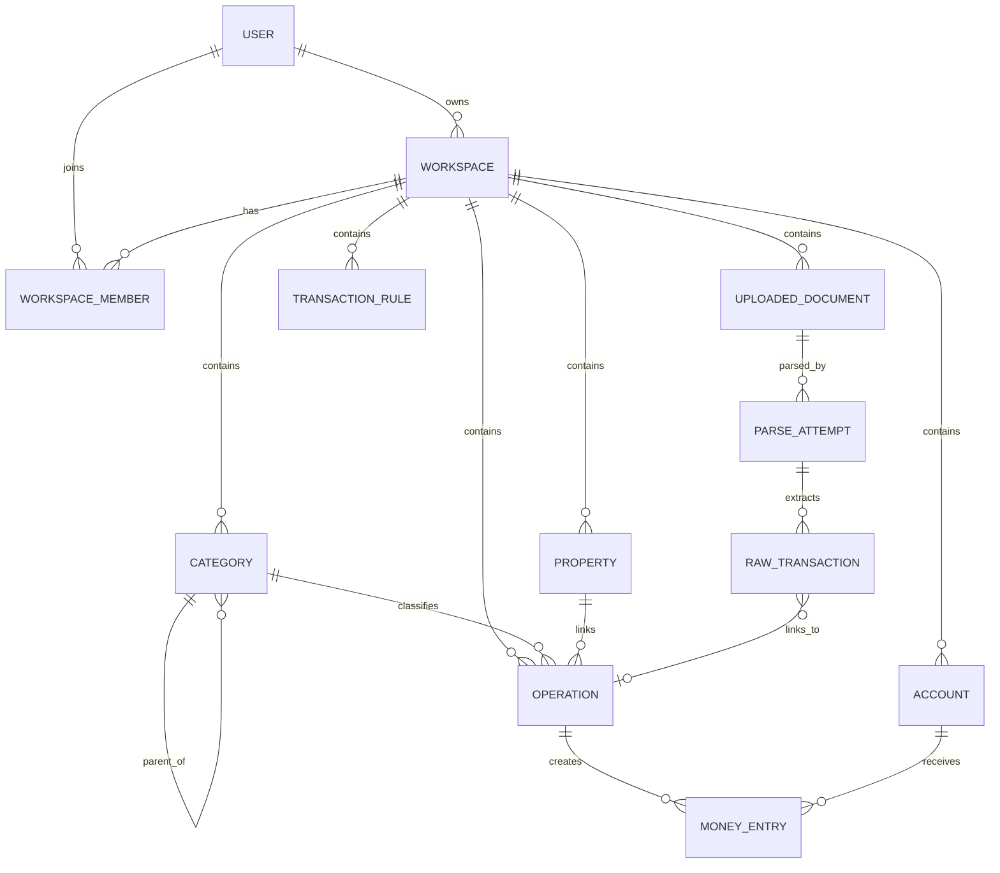

# DOMAIN_MODEL.md — Booker Tee

Canonical domain model for Booker Tee.

This document is the source of truth for business entities, relationships, invariants, and MVP boundaries. Coding agents must read this file before changing database models, migrations, repositories, services, import logic, or financial reports.

## 1. Product domain in one paragraph

Booker Tee is a private financial assistant that turns manual cash operations and imported bank statements into reliable, reviewable, confirmed accounting records. The first product focus is not AI chat, dashboards, or full property management. The first product focus is this pipeline:

```text
PDF bank statement / manual entry
  -> raw extracted data
  -> normalized draft records
  -> validation and deduplication
  -> user review
  -> confirmed operations and account movements
```

The domain model must prevent the most dangerous financial error: counting the same money movement as income several times.

Example:

```text
1. Received cash rent for property "9 Maya 20"  -> income, affects profit
2. Deposited this cash to a bank card            -> internal transfer, does not affect profit
3. Moved money from card to deposit              -> internal transfer, does not affect profit
```

Only the first event is income. The second and third events only change where the same money is stored.

## 2. Core concepts

```text
User              = a human identity that can log in
Workspace         = a strict financial data boundary: personal, family, business, property management, project
WorkspaceMember   = user membership and role inside a workspace
Account           = where money is stored: cash, card, deposit, checking account
Operation         = business meaning of a money event: income, expense, transfer, adjustment
MoneyEntry        = signed movement on a concrete account
Category          = why money appeared or disappeared
Property          = optional real estate object linked to profit/loss analytics
UploadedDocument  = uploaded PDF or other source document
ParseAttempt      = one parser run against an uploaded document
RawTransaction    = extracted bank row before confirmation
TransactionRule   = workspace-specific rule for suggestions/autocategorization
```

Recommended accounting shape:

```text
Operation 1 -> N MoneyEntry
```

Do not model every confirmed financial event as a single flat `Transaction` row with only `amount` and `account_id`. Internal transfers need at least two money entries: one negative entry on the source account and one positive entry on the destination account.

## 3. High-level relationship diagram



## 4. Workspace-first rule

A `User` is not the main ownership boundary for financial data.

A `Workspace` is the main ownership boundary.

Almost every business table must have `workspace_id`:

```text
accounts.workspace_id
categories.workspace_id
properties.workspace_id
operations.workspace_id
money_entries.workspace_id        optional but recommended as denormalized guard
uploaded_documents.workspace_id
parse_attempts.workspace_id
raw_transactions.workspace_id
transaction_rules.workspace_id
```

Use `created_by_user_id`, `updated_by_user_id`, `uploaded_by_user_id`, or audit fields to record who did something.

Do not use `user_id` as the main ownership field for accounts, operations, categories, documents, properties, or rules.

### Query invariant

Every query for workspace-owned data must be scoped by `workspace_id`.

Bad:

```python
select(Operation).where(Operation.id == operation_id)
```

Good:

```python
select(Operation).where(
    Operation.id == operation_id,
    Operation.workspace_id == current_workspace_id,
)
```

This rule applies to reads, updates, deletes, imports, exports, reports, and background jobs.

## 5. MVP entities

The MVP should include these entities:

```text
User
Workspace
WorkspaceMember
Account
Category
Property
Operation
MoneyEntry
UploadedDocument
ParseAttempt
RawTransaction
TransactionRule
```

The MVP should not implement these yet unless explicitly requested:

```text
full custom RBAC UI
WorkspaceInvitation UI
AuditLog UI
Counterparty management
Tenant management
lease contracts
utility meters
vacancy metrics
RAG
Text-to-SQL
local LLM assistant
Telegram ingestion
IMAP ingestion
SaaS billing
```

Some future entities may still be mentioned in this file to protect the model from bad early decisions.

## 6. Entity: User

A user is a human identity that can authenticate and participate in one or more workspaces.

### Required fields

```text
id: UUID
email: string, unique, normalized
password_hash: string
name: string | null
is_active: bool
created_at: datetime
updated_at: datetime
```

### Notes

- A user can belong to many workspaces.
- A user may own many workspaces.
- A user should automatically receive a personal workspace after registration.
- Do not attach financial data directly to `user_id` unless it is truly identity-specific.

## 7. Entity: Workspace

A workspace is a strict financial context and data boundary.

Examples:

```text
Personal budget
Family budget
Small business
Property management
Separate project
```

### Required fields

```text
id: UUID
owner_id: UUID -> users.id
name: string
slug: string | null
type: WorkspaceType
default_currency: string, e.g. "RUB"
is_active: bool
created_at: datetime
updated_at: datetime
archived_at: datetime | null
```

### WorkspaceType enum

```text
personal
family
business
property_management
project
other
```

### Invariants

- A workspace must have one owner.
- The owner must also have a `WorkspaceMember` record with role `owner`.
- Financial reports must be calculated inside one workspace unless a future explicit cross-workspace report feature is implemented.
- Cross-workspace reports must never bypass membership/permission checks.

## 8. Entity: WorkspaceMember

A membership connects a user to a workspace and defines that user's role.

### Required fields

```text
id: UUID
workspace_id: UUID -> workspaces.id
user_id: UUID -> users.id
role: WorkspaceRole
status: WorkspaceMemberStatus
invited_by_user_id: UUID | null -> users.id
joined_at: datetime | null
created_at: datetime
updated_at: datetime
```

### WorkspaceRole enum

```text
owner
admin
editor
viewer
uploader
analyst
```

### WorkspaceMemberStatus enum

```text
pending
active
disabled
removed
```

### Minimal MVP behavior

For MVP, it is enough to create:

```text
User registers
  -> create personal Workspace
  -> create WorkspaceMember(role="owner", status="active")
```

Full invitations and custom permissions can be added later.

### Unique constraints

```text
unique(workspace_id, user_id)
```

## 9. Entity: Account

An account is a place where money is stored.

Examples:

```text
Cash safe
Pocket cash
T-Bank card
Sber card
Checking account
Bank deposit
```

### Required fields

```text
id: UUID
workspace_id: UUID -> workspaces.id
name: string
type: AccountType
currency: string
initial_balance: Numeric(14, 2), default 0
is_active: bool
created_at: datetime
updated_at: datetime
archived_at: datetime | null
```

### Optional fields

```text
bank_name: string | null
account_number_masked: string | null
account_number_fingerprint: string | null
card_last4: string | null
external_ref: string | null
notes: text | null
```

### AccountType enum

```text
cash
card
deposit
checking
other
```

Future types may include:

```text
loan
brokerage
crypto_wallet
```

Do not add future types unless the product actually needs them.

### Balance rule

Canonical account balance:

```text
account_balance = account.initial_balance
                + sum(money_entries.amount)
                  where operation.status = "confirmed"
                  and money_entries.account_id = account.id
```

Draft, ignored, duplicate, and needs-review operations must not change the official balance.

It is allowed to cache balances later for performance, but cached balances must be derived from confirmed `MoneyEntry` records and must be repairable by recalculation.

### Privacy rule

Never store full card numbers in plain text.

Prefer:

```text
card_last4
account_number_masked
account_number_fingerprint / hash
```

## 10. Entity: Category

A category explains why money appeared or disappeared.

Examples:

```text
Rent income
Utilities
Repair
Food
Taxes
Transfer
Adjustment
Refund
Ignore / Do not count
```

### Required fields

```text
id: UUID
workspace_id: UUID -> workspaces.id
parent_id: UUID | null -> categories.id
name: string
kind: CategoryKind
is_system: bool
system_key: string | null
sort_order: int
created_at: datetime
updated_at: datetime
```

### CategoryKind enum

```text
income
expense
transfer
adjustment
mixed
```

### System categories

Every workspace should get a small default set of system categories:

```text
transfer
adjustment
refund
duplicate
ignore
uncategorized
```

These categories must not be casually deleted. They can be hidden or archived if necessary.

### Invariants

- Categories are workspace-specific.
- A category in a personal workspace is not the same entity as a category in a business workspace.
- Category names can repeat across workspaces.
- Category trees must not form cycles.

## 11. Entity: Property

A property is a real estate object used for property-linked analytics.

For MVP, keep this entity small.

### Required fields

```text
id: UUID
workspace_id: UUID -> workspaces.id
name: string
short_name: string | null
address: text | null
status: PropertyStatus
created_at: datetime
updated_at: datetime
archived_at: datetime | null
```

### PropertyStatus enum

```text
active
inactive
archived
```

Future statuses may include:

```text
available
occupied
repair
sold
```

Do not implement tenant lifecycle, leases, meters, vacancy metrics, or full property management in the first MVP.

### Property report rule

Property profit/loss must use only confirmed operations:

```text
operation.status = "confirmed"
operation.affects_profit = true
operation.property_id = target_property_id
```

Internal transfers must not affect property ROI.

## 12. Entity: Operation

An operation is the business meaning of a money event.

Examples:

```text
Received rent in cash
Paid utility bill from card
Deposited cash to card
Moved money from card to deposit
Corrected opening balance
Marked imported row as duplicate
```

### Required fields

```text
id: UUID
workspace_id: UUID -> workspaces.id
type: OperationType
status: OperationStatus
affects_profit: bool
category_id: UUID | null -> categories.id
property_id: UUID | null -> properties.id
description: text | null
operation_date: date
posting_date: date | null
source: OperationSource
created_by_user_id: UUID | null -> users.id
updated_by_user_id: UUID | null -> users.id
created_at: datetime
updated_at: datetime
confirmed_at: datetime | null
```

### Optional fields

```text
external_id: string | null
notes: text | null
metadata: jsonb | null
```

### OperationType enum

```text
income
expense
transfer
adjustment
```

### OperationStatus enum

```text
draft
needs_review
confirmed
ignored
duplicate
```

### OperationSource enum

```text
manual
bank_pdf
telegram
email
system
imported_csv
```

For MVP, implement only:

```text
manual
bank_pdf
system
```

### Operation type rules

| Operation type | Money entries | affects_profit | Meaning |
|---|---:|---:|---|
| `income` | usually 1 positive entry | `true` by default | Money appeared because the user earned/received income |
| `expense` | usually 1 negative entry | `true` by default | Money disappeared because the user spent money |
| `transfer` | exactly 2 entries in MVP | always `false` | Money moved between the user's own accounts |
| `adjustment` | usually 1 entry | usually `false` | Balance correction, opening balance, non-profit inflow/outflow |

### Invariants

- `transfer` operations must not affect profit.
- `transfer` operations must not affect property ROI.
- `transfer` operations must balance to zero per currency in MVP.
- `income` and `expense` operations should affect profit unless explicitly marked otherwise for a valid reason.
- Confirmed operations should not be hard-deleted. Prefer status changes, reversals, or audit records.
- Operations in `draft`, `needs_review`, `ignored`, or `duplicate` status must not change official account balances or profit reports.

### Tenant security deposit rule

A tenant security deposit is money held by the user but not earned yet.

For MVP, represent it as:

```text
Operation.type = "adjustment"
Operation.affects_profit = false
Category = "Tenant deposit" / "Security deposit"
MoneyEntry.amount = positive amount on the receiving account
Property = target property if useful
```

Do not count tenant security deposits as income until the money is retained for a valid reason. A future liabilities module can model this more accurately.

## 13. Entity: MoneyEntry

A money entry is an actual signed movement on one account.

Positive amount increases account balance.

Negative amount decreases account balance.

### Required fields

```text
id: UUID
workspace_id: UUID -> workspaces.id
operation_id: UUID -> operations.id
account_id: UUID -> accounts.id
amount: Numeric(14, 2)
currency: string
entry_order: int
created_at: datetime
```

### Optional fields

```text
balance_after: Numeric(14, 2) | null
metadata: jsonb | null
```

### Invariants

- `money_entries.workspace_id` must match `operations.workspace_id`.
- `money_entries.workspace_id` must match `accounts.workspace_id`.
- Never use `float` for `amount`.
- Use signed amounts.
- For same-currency transfer in MVP:

```text
sum(money_entries.amount where operation_id = transfer_operation.id) = 0
```

### Cross-currency rule

Do not implement cross-currency transfers in the first MVP.

If a transfer changes currency, future versions should add explicit exchange-rate metadata or a dedicated FX operation type. Until then, reject or mark cross-currency transfer attempts as unsupported.

## 14. Entity: UploadedDocument

An uploaded document stores file metadata and import status.

For MVP, the main document type is a bank PDF statement.

### Required fields

```text
id: UUID
workspace_id: UUID -> workspaces.id
source: UploadedDocumentSource
document_type: UploadedDocumentType
status: UploadedDocumentStatus
original_filename: string
storage_key: string
content_type: string | null
file_size_bytes: int | null
sha256_hash: string
uploaded_by_user_id: UUID | null -> users.id
created_at: datetime
updated_at: datetime
```

### Optional fields

```text
bank_name: string | null
statement_type: string | null
statement_period_start: date | null
statement_period_end: date | null
account_id: UUID | null -> accounts.id
metadata: jsonb | null
```

### UploadedDocumentSource enum

```text
web_upload
telegram
email
system
```

For MVP, implement only:

```text
web_upload
system
```

### UploadedDocumentType enum

```text
bank_statement
receipt
contract
act
other
```

For MVP, implement only:

```text
bank_statement
other
```

### UploadedDocumentStatus enum

```text
uploaded
pending_parse
parsing
parsed
requires_review
failed_to_parse
imported
ignored
```

### Invariants

- Store document metadata before parsing starts.
- Do not lose uploaded files when parsing fails.
- Do not store sensitive file contents in application logs.
- The same file hash uploaded twice should not create duplicate confirmed operations silently.

## 15. Entity: ParseAttempt

A parse attempt records one parser run against one uploaded document.

A single document may have many attempts because parsers can be fixed and rerun.

### Required fields

```text
id: UUID
workspace_id: UUID -> workspaces.id
uploaded_document_id: UUID -> uploaded_documents.id
parser_name: string
parser_version: string | null
status: ParseAttemptStatus
started_at: datetime
finished_at: datetime | null
created_at: datetime
```

### Optional fields

```text
error_code: string | null
error_message_sanitized: text | null
raw_text_storage_key: string | null
raw_tables_json: jsonb | null
control_totals_json: jsonb | null
validation_report_json: jsonb | null
metadata: jsonb | null
```

### ParseAttemptStatus enum

```text
running
success
requires_review
failed
```

### Invariants

- Parser failures must be stored as failed attempts, not swallowed.
- Raw extracted tables should be preserved for debugging.
- Error messages must be sanitized: no full card numbers, no passwords, no full document dumps.
- The latest successful attempt does not delete older attempts.

## 16. Entity: RawTransaction

A raw transaction is an extracted bank row before the system turns it into a confirmed operation.

It is not yet trusted accounting data.

### Required fields

```text
id: UUID
workspace_id: UUID -> workspaces.id
uploaded_document_id: UUID -> uploaded_documents.id
parse_attempt_id: UUID -> parse_attempts.id
row_index: int
status: RawTransactionStatus
raw_payload: jsonb
created_at: datetime
updated_at: datetime
```

### Raw fields

```text
operation_date_raw: string | null
posting_date_raw: string | null
description_raw: text | null
amount_raw: string | null
currency_raw: string | null
balance_after_raw: string | null
account_hint_raw: string | null
```

### Normalized fields

```text
account_id: UUID | null -> accounts.id
operation_date: date | null
posting_date: date | null
description_normalized: text | null
amount: Numeric(14, 2) | null
currency: string | null
balance_after: Numeric(14, 2) | null
dedupe_hash: string | null
confidence_score: Numeric(5, 4) | null
linked_operation_id: UUID | null -> operations.id
```

### RawTransactionStatus enum

```text
extracted
normalized
suggested
needs_review
matched
ignored
duplicate
failed
```

### Invariants

- Raw transactions must not directly affect balances.
- Raw transactions must not directly affect profit.
- A raw transaction may link to a confirmed operation after review.
- Many raw transactions may link to one operation. Example: two bank statement rows can represent one internal transfer.
- If the parser is uncertain, use `needs_review`.

## 17. Entity: TransactionRule

A transaction rule is a workspace-specific rule that suggests or autofills operation fields from imported or manual data.

Example:

```text
If description contains "Alexey V." and amount is +40000,
suggest:
  type = income
  category = Rent
  property = 9 Maya 20
  description = Rent for 9 Maya 20
```

### Required fields

```text
id: UUID
workspace_id: UUID -> workspaces.id
name: string
is_active: bool
priority: int
match_type: TransactionRuleMatchType
pattern: string
created_by_user_id: UUID | null -> users.id
created_at: datetime
updated_at: datetime
```

### Optional matching fields

```text
account_id: UUID | null -> accounts.id
amount_min: Numeric(14, 2) | null
amount_max: Numeric(14, 2) | null
direction: MoneyDirection | null
```

### Suggested output fields

```text
target_operation_type: OperationType | null
category_id: UUID | null -> categories.id
property_id: UUID | null -> properties.id
auto_description: text | null
affects_profit: bool | null
```

### TransactionRuleMatchType enum

```text
contains
exact
regex
counterparty
recurrence
```

For MVP, implement only:

```text
contains
exact
```

### MoneyDirection enum

```text
inflow
outflow
any
```

### Invariants

- Rules are workspace-specific.
- Rules should suggest or prefill data, not silently confirm risky imports.
- Rules must not cross workspace boundaries.
- A rule matching `OZON` in a personal workspace must not affect a business workspace.

## 18. Import pipeline

Use this pipeline for bank statements:

```text
1. User uploads PDF in active workspace
2. Create UploadedDocument(status="uploaded")
3. Create ParseAttempt(status="running")
4. Extract raw text/tables with pdfplumber
5. Detect parser by document markers
6. Save raw extracted rows as RawTransaction(status="extracted")
7. Normalize dates, amounts, currency, description, account hints
8. Calculate dedupe hashes
9. Validate control totals when available
10. Apply transaction rules as suggestions
11. Create draft/needs_review Operation + MoneyEntry candidates if appropriate
12. User reviews
13. Confirm operations
14. Link RawTransaction rows to confirmed Operation records
```

### Parser rule

A parser must never create confirmed operations directly.

Bad:

```text
PDF parser -> confirmed Operation
```

Good:

```text
PDF parser -> RawTransaction -> suggested Operation -> user review -> confirmed Operation
```

## 19. Statement validation

When a bank statement contains control totals, parse them and validate the import.

Common totals:

```text
opening_balance
income_total
expense_total
closing_balance
```

Expected formula:

```text
opening_balance + income_total - expense_total = closing_balance
```

If the formula does not match:

```text
UploadedDocument.status = "requires_review"
ParseAttempt.status = "requires_review"
RawTransaction.status = "needs_review" for uncertain rows
```

Do not publish confirmed operations automatically when control totals fail.

## 20. Deduplication

Imports must be idempotent.

Suggested dedupe hash input:

```text
workspace_id
account_id
operation_date
posting_date if available
amount
currency
normalized_description
balance_after if available
uploaded_document_id or statement period when useful
```

### Duplicate behavior

High confidence duplicate:

```text
RawTransaction.status = "duplicate"
Operation.status = "duplicate" or no new operation created
```

Medium confidence duplicate:

```text
RawTransaction.status = "needs_review"
Show possible match to user
```

The same PDF or overlapping statement periods must not double-count income or expenses.

## 21. Business scenarios

### 21.1 Rent received in cash, then deposited to card, then moved to deposit

Amount: `40000 RUB`.

#### Operation 1: rent income

```text
Operation:
  type = income
  status = confirmed
  affects_profit = true
  category = Rent
  property = 9 Maya 20
  operation_date = 2026-06-13

MoneyEntry:
  account = Cash / Safe
  amount = +40000 RUB
```

#### Operation 2: cash deposited to card

```text
Operation:
  type = transfer
  status = confirmed
  affects_profit = false
  category = Transfer
  property = null

MoneyEntry 1:
  account = Cash / Safe
  amount = -40000 RUB

MoneyEntry 2:
  account = T-Bank Card
  amount = +40000 RUB
```

#### Operation 3: card moved to deposit

```text
Operation:
  type = transfer
  status = confirmed
  affects_profit = false
  category = Transfer
  property = null

MoneyEntry 1:
  account = T-Bank Card
  amount = -40000 RUB

MoneyEntry 2:
  account = T-Bank Deposit
  amount = +40000 RUB
```

#### Correct reports

```text
Property "9 Maya 20" income: +40000 RUB
Total profit: +40000 RUB
Cash balance change: 0 RUB
Card balance change: 0 RUB
Deposit balance change: +40000 RUB
Total assets change: +40000 RUB
```

Incorrect result to avoid:

```text
Rent income +40000
Cash deposit +40000
Deposit top-up +40000
Total income +120000  <-- wrong
```

### 21.2 Imported bank row: cash deposit to card

Bank row:

```text
+40000 RUB "Cash deposit via ATM"
```

This row is ambiguous. It can be:

```text
new income
transfer from cash
balance adjustment
refund
```

Default behavior:

```text
RawTransaction.status = "needs_review"
Suggested operation type = transfer from Cash to Card if matching cash account exists
```

Do not automatically count this as income.

### 21.3 Transfer between two imported bank accounts

Card statement:

```text
-40000 RUB "Transfer to deposit"
```

Deposit statement:

```text
+40000 RUB "Deposit top-up"
```

Expected result:

```text
One Operation(type="transfer", affects_profit=false)
Two MoneyEntry rows
Two RawTransaction rows linked to the same Operation
```

### 21.4 Property expense

```text
Operation:
  type = expense
  affects_profit = true
  category = Repair
  property = 9 Maya 20

MoneyEntry:
  account = T-Bank Card
  amount = -8500 RUB
```

This reduces profit for property `9 Maya 20`.

### 21.5 Tenant security deposit

```text
Operation:
  type = adjustment
  affects_profit = false
  category = Tenant deposit
  property = 9 Maya 20

MoneyEntry:
  account = T-Bank Card
  amount = +40000 RUB
```

This increases account balance but does not increase profit.

If the deposit is later retained for damage, create a future operation that recognizes the retained amount as income or offsets repair expense according to the chosen accounting rule.

## 22. Reporting rules

### Account balance

```text
initial_balance + confirmed money entries for account
```

### Workspace profit/loss

```text
sum(money_entries.amount)
where operation.workspace_id = current_workspace_id
and operation.status = "confirmed"
and operation.affects_profit = true
```

### Property profit/loss

```text
sum(money_entries.amount)
where operation.workspace_id = current_workspace_id
and operation.status = "confirmed"
and operation.affects_profit = true
and operation.property_id = target_property_id
```

### Category report

```text
sum(money_entries.amount)
group by operation.category_id
where operation.status = "confirmed"
and operation.affects_profit = true
```

### Transfer report

```text
show operations where operation.type = "transfer"
do not include them in income, expense, profit, or ROI totals
```

### Review queue

```text
RawTransaction.status in ("extracted", "normalized", "suggested", "needs_review")
Operation.status in ("draft", "needs_review")
UploadedDocument.status in ("requires_review", "failed_to_parse")
```

## 23. Money precision and currency

### Required rules

- Use `Decimal` in Python.
- Use PostgreSQL `Numeric(14, 2)` or stricter for money.
- Never use `float` for money.
- Store currency explicitly on accounts and money entries.
- Amounts must be signed.
- In MVP, do not allow one operation to mix currencies unless it is explicitly unsupported or reviewed.

### Recommended Python style

```python
from decimal import Decimal

amount = Decimal("40000.00")
```

## 24. Deletion and correction rules

Financial records should be treated as audit-sensitive.

For MVP:

```text
Draft records may be deleted.
Confirmed records should not be hard-deleted casually.
Prefer status changes, correction operations, or soft-delete/archive fields.
```

Future versions should add:

```text
AuditLog
reversal operations
who/when/what changed history
```

## 25. Suggested indexes

Workspace-scoped queries will be frequent.

Recommended indexes:

```text
users.email unique
workspace_members(workspace_id, user_id) unique
accounts(workspace_id, type)
accounts(workspace_id, is_active)
categories(workspace_id, parent_id)
properties(workspace_id, status)
operations(workspace_id, operation_date)
operations(workspace_id, status)
operations(workspace_id, type)
operations(workspace_id, category_id)
operations(workspace_id, property_id)
money_entries(workspace_id, account_id)
money_entries(operation_id)
uploaded_documents(workspace_id, status)
uploaded_documents(workspace_id, sha256_hash)
parse_attempts(uploaded_document_id, created_at)
raw_transactions(workspace_id, status)
raw_transactions(workspace_id, dedupe_hash)
raw_transactions(linked_operation_id)
transaction_rules(workspace_id, is_active, priority)
```

## 26. Foreign key and delete behavior

Recommended behavior:

```text
Workspace -> Account: restrict delete if confirmed entries exist
Workspace -> Operation: restrict hard delete, prefer archive/export/delete workspace later
Operation -> MoneyEntry: cascade delete only for draft operations, otherwise restrict
Category -> Operation: restrict delete if used, allow archive/hide
Property -> Operation: restrict delete if used, allow archive
UploadedDocument -> ParseAttempt: cascade only if document is safely deleted before import
UploadedDocument -> RawTransaction: restrict after import, preserve raw history
RawTransaction -> Operation: set null or restrict depending on review flow
```

For MVP, avoid complex hard-delete behavior. Prefer `archived_at`, `is_active`, and statuses.

## 27. MVP implementation order

The MVP is **parser-first and ledger-ready**.

The primary MVP hypothesis is not whether Booker Tee can work as a manual finance tracker.
The primary MVP hypothesis is whether Booker Tee can reliably transform real bank PDF statements into trusted financial data.

Therefore, implementation must prioritize the PDF import pipeline while keeping enough ledger infrastructure to post confirmed rows into accounts.

```text
PDF bank statement
  -> uploaded source document
  -> parser attempt
  -> raw extracted tables
  -> raw transactions
  -> normalized draft rows
  -> validation and deduplication
  -> review screen
  -> confirmed Operation + MoneyEntry records
  -> account balance and simple reports
```

### 27.1 Model implementation order

This order is optimized for the first PDF-to-ledger flow.

```text
1. User
2. Workspace
3. WorkspaceMember
4. Account
5. UploadedDocument
6. ParseAttempt
7. RawTransaction
8. Operation
9. MoneyEntry
10. Category
11. Property
12. TransactionRule
```

Notes:

```text
- User, Workspace, and WorkspaceMember are required first because every imported file and every account must belong to a workspace.
- Account is required before PDF upload because imported rows need a target account.
- UploadedDocument, ParseAttempt, and RawTransaction come before Operation and MoneyEntry because parsers must preserve raw data before posting confirmed financial records.
- Operation and MoneyEntry are still required in the MVP because confirmed imported rows must affect account balances.
- Category can start as a minimal seed only; full category management is not required before the PDF pipeline works.
- Property can start as an optional minimal link for landlord use cases.
- TransactionRule must come after review and confirmation. First the system must learn from user decisions; then it can suggest rules.
```

### 27.2 Feature implementation order

Do not start by building a complete manual finance tracker.
Build the PDF pipeline first.

```text
1. Project infrastructure: FastAPI, PostgreSQL, SQLAlchemy, Alembic, tests, basic templates
2. Minimal User + automatic personal Workspace
3. WorkspaceMember owner membership and current workspace context
4. Minimal Account model and account creation/listing
5. UploadedDocument: PDF upload, file storage, metadata, status, checksum
6. ParseAttempt: parser execution status, errors, extracted raw tables JSON
7. Parser interface and first bank parser for one real statement type
8. Raw table extraction with pdfplumber
9. RawTransaction storage from extracted rows
10. Raw transaction normalization: dates, Decimal amounts, currency, description
11. Statement validation: opening balance, closing balance, total inflow, total outflow when available
12. Review screen for parsed rows
13. Confirm selected raw rows into Operation + MoneyEntry
14. Balance calculation from MoneyEntry
15. Deduplication and repeat-upload protection
16. Minimal Category seed: Uncategorized, Transfer, Adjustment, Income, Expense
17. Optional minimal Property link for landlord use cases
18. Minimal reports: account balance and imported rows summary
19. TransactionRule suggestions based on repeated confirmed decisions
20. Manual operations: income, expense, transfer
21. Additional banks and parser configs
```

### 27.3 MVP rule

Do not build a full manual finance tracker before validating the PDF import pipeline.

Manual operations, full category management, full property management, reports, collaboration, Telegram import, email import, AI, RAG, Text-to-SQL, and advanced analytics must not block the first working PDF-to-ledger flow.

The first complete vertical slice must be:

```text
Upload one real PDF statement
  -> store source document
  -> create parse attempt
  -> extract raw tables
  -> create raw transactions
  -> normalize rows
  -> validate totals when possible
  -> show review screen
  -> confirm rows
  -> create Operation + MoneyEntry
  -> calculate account balance
```

### 27.4 First MVP acceptance checklist

The first MVP is acceptable only when the system can do all of the following for at least one supported bank statement type:

```text
1. Upload a PDF statement.
2. Store the original file and metadata.
3. Create a ParseAttempt for every parser run.
4. Preserve extracted raw table data as JSON.
5. Create RawTransaction rows from extracted data.
6. Normalize operation date, amount, currency, and description.
7. Validate statement totals when the PDF contains them.
8. Mark uncertain rows or mismatched statements as requires_review.
9. Show a review screen before confirmed posting.
10. Confirm selected rows into Operation + MoneyEntry.
11. Calculate account balance from MoneyEntry, not from mutable account fields.
12. Prevent repeated uploads from double-counting the same money.
13. Preserve raw data even when parsing fails.
```

### 27.5 Explicit non-goals for the first MVP

These features are intentionally not required for the first PDF-to-ledger MVP:

```text
full authentication and team invitations
full RBAC
family/business workspace switching UI
complete manual finance tracker
complex category CRUD
complete property management
lease and tenant management
security deposits workflow
utility meters
vacancy tracking
Telegram bot
IMAP email import
AI/RAG
Text-to-SQL
advanced dashboards
mobile app
```

The MVP must stay narrow:

```text
Real bank PDF -> trusted reviewed financial records.
```

## 28. Future entities

These are intentionally not part of the first MVP, but the current model should not block them.

### Counterparty

Useful later for tenants, contractors, banks, family members, and business partners.

```text
Counterparty
- id
- workspace_id
- name
- type
- metadata
```

### WorkspaceInvitation

Useful later for family/business collaboration.

```text
WorkspaceInvitation
- id
- workspace_id
- email
- role
- token_hash
- status
- expires_at
```

### AuditLog

Important for financial trust.

```text
AuditLog
- id
- workspace_id
- actor_user_id
- entity_type
- entity_id
- action
- before_json
- after_json
- created_at
```

### RecurringOperation

Useful for rent, subscriptions, mortgage, taxes, regular family expenses.

```text
RecurringOperation
- id
- workspace_id
- template_operation_data
- schedule
- next_run_date
```

### Debt / Liability

Useful for loans, tenant deposits, unpaid invoices, and debts.

```text
Liability
- id
- workspace_id
- counterparty_id
- amount
- currency
- status
```

### VirtualEnvelope

Useful for mental budgeting inside one physical account.

```text
VirtualEnvelope
- id
- workspace_id
- account_id
- name
- target_amount
```

### GenericDocument

Useful later for contracts, acts, insurance, certificates, property files.

```text
GenericDocument
- id
- workspace_id
- property_id
- counterparty_id
- document_type
- storage_key
- metadata
```

## 29. Terms to avoid

Avoid product wording that implies illegal or suspicious accounting.

Do not use public-facing terms like:

```text
серый учет
неофициальная бухгалтерия
скрытые доходы
```

Prefer:

```text
private financial tracking
management accounting
cash-flow visibility
multi-source financial data
personal and business finance organization
```

In Russian UI or docs, prefer:

```text
личный и управленческий учет
приватный финансовый архив
учет денег из разных источников
структурирование финансовых данных
```

## 30. Non-negotiable invariants

These rules must not be broken:

1. Workspaces are strict data boundaries.
2. Every workspace-owned query must filter by `workspace_id`.
3. Money uses `Decimal` / `Numeric`, never `float`.
4. Internal transfers never count as income, expense, profit, or property ROI.
5. Raw imported data must be preserved.
6. Parsers must not create confirmed operations directly.
7. Failed parsing must not delete documents.
8. Control-total mismatch must require review.
9. Duplicate imports must not double-count money.
10. Tenant security deposits are not income until retained.
11. Draft/review/ignored/duplicate operations do not affect official balances.
12. Confirmed financial records should be corrected carefully, not casually hard-deleted.
